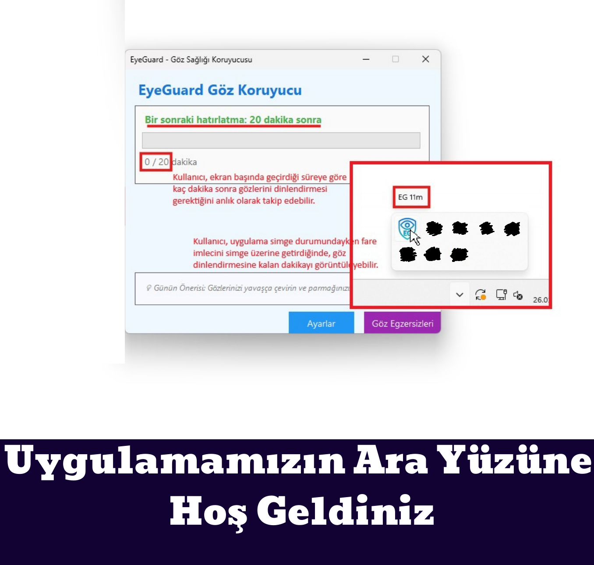
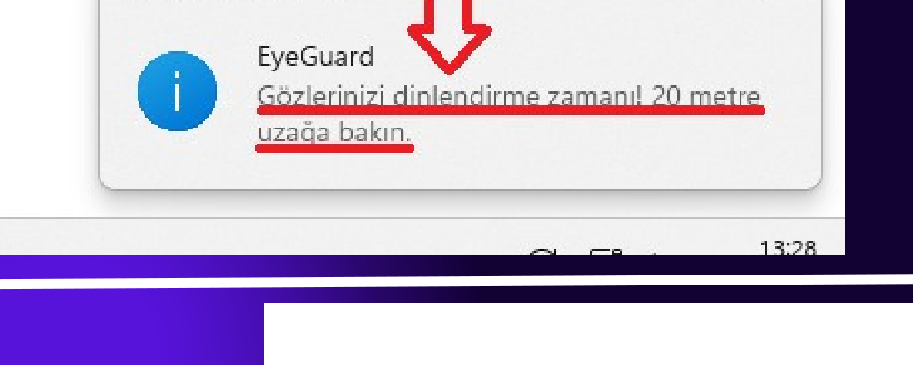
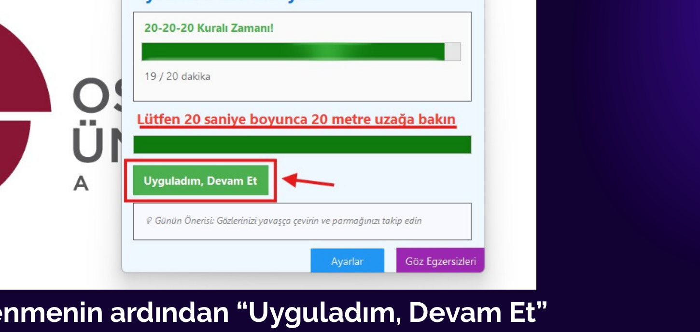
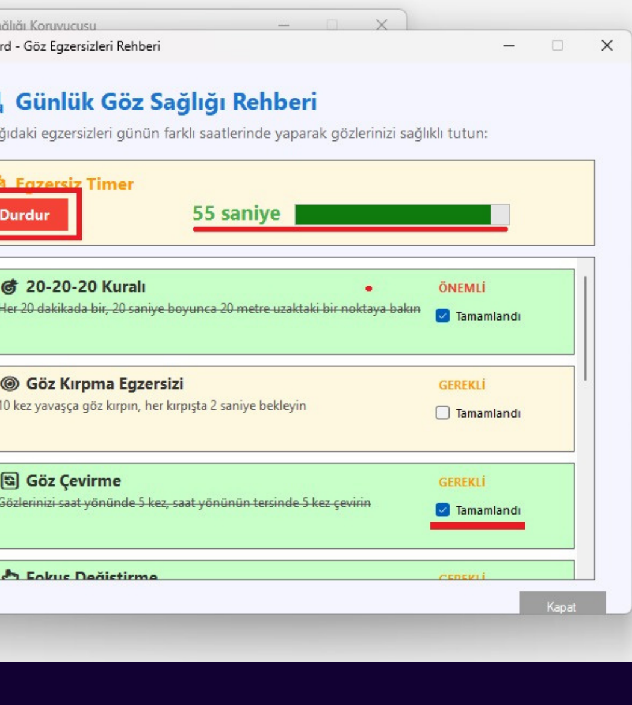

# EyeGuard (Windows)

> “Elimizdeki en gelişmiş kamera gözlerimizdir; onları korumak, hayata bakışımızı korumaktır.”

**EyeGuard**, dijital dünyada uzun süre ekran karşısında kalan kullanıcılar için geliştirilmiş bir **göz sağlığı asistanıdır**. Ortalama 7–9 saat ekran süresi ve buna bağlı *Dijital Göz Yorgunluğu (CVS)* belirtileri (yanma, kuruluk, bulanık görme) modern çağın yaygın bir gerçeğidir. EyeGuard bu noktada düzenli molaları hatırlatmayı ve basit göz egzersizleriyle rahatlamayı hedefler.

## Neler Sunar?

- **Akıllı uyarı sistemi:** Belirlediğiniz aralıklarla ekranda dost canlısı hatırlatıcılar gösterir.  
- **Pratik egzersizler:** Sadece durmanızı değil, göz kaslarınızı çalıştırmanızı sağlar.  
- **20-20-20 yaklaşımı:** Her 20 dakikada bir, 20 saniye boyunca yaklaşık 6 metre uzağa bakma kuralını sizin yerinize takip eder.

## Nasıl Çalışır? (20-20-20)

Kural basittir: **Her 20 dakikada bir, 20 saniye boyunca yaklaşık 6 metre (20 fit) uzağa bakın.**  
Bu, odaklanma kaslarını gevşetmeye yardımcı olur ve göz yorgunluğunu azaltır.

## Ekran Görüntüleri

| Ana Ekran | Hatırlatıcı / Bildirim |
|---|---|
|  |  |

| Molaya Geçiş Ekranı | Günlük Görevler / Egzersizler |
|---|---|
|  |  |

## İndirme & Kurulum

Bu depoda **kaynak kod paylaşılmayabilir** (binary-only yayın). Uygulamayı indirmek için:

1. Depodaki **EyeGuardSetup/Debug** sayfasına gidin.
2. En son sürümü indirin: `EyeGuard_Setup.exe` veya `EyeGuard.msi`
3. Kurulumu çalıştırın ve yönergeleri izleyin.

> İpucu: Güven için Release notlarında **SHA256** checksum paylaşmanız önerilir.

## Hızlı Kullanım

- Uygulamayı açın ve hatırlatma aralığını belirleyin.
- Süre dolduğunda uyarı verir.
- Yaklaşık kısa bir dinlenmeden sonra **“Uyguladım, Devam Et”** ile çalışmaya devam edebilirsiniz.

## Günlük Görevler & Egzersizler

Uygulama, kullanıcıları egzersiz yapmaya teşvik etmek için **farklı önem seviyelerinde günlük görevler** sunar. Görevler renklerle sınıflandırılabilir:
- **Kırmızı:** kesinlikle yapılmalı  
- **Sarı:** önerilen  
- **Mavi:** isteğe bağlı  

## Planlar

- **Free Plan:** Tarife planları ve kullanım detayları `docs/PLANS.md` içerisinde açıklanmıştır..
- **Basic Plan:** Tarife planları ve kullanım detayları `docs/PLANS.md` içerisinde açıklanmıştır.
- **Premium Plan:** Tarife planları ve kullanım detayları `docs/PLANS.md` içerisinde açıklanmıştır.

Her görev için genellikle **60 saniyelik bir sayaç** bulunur; süre sonunda görev tamamlanmış olarak kaydedilebilir.

## Sık Sorulan Sorular

- `docs/FAQ.md`

## Sağlık Uyarısı (Önemli)

EyeGuard, **tıbbi bir cihaz değildir** ve teşhis/tedavi amacı taşımaz. Şikayetleriniz devam ediyorsa bir göz hekimine danışın.

---

© EyeGuard — Tüm hakları saklıdır.
